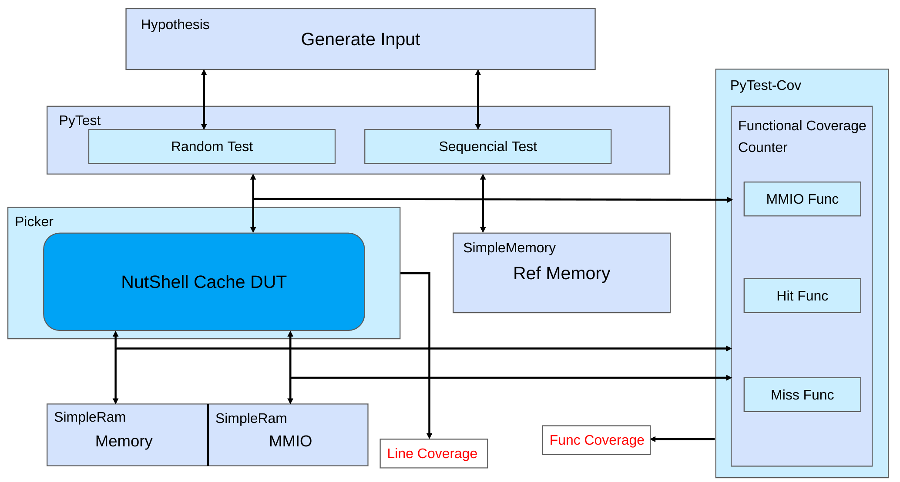

# Nutshell Cache Verification with XS-MLVP
基于XS-MLVP验证环境的Nutshell Cache的验证实践

## Framework


## Python Structure
```
python
├── CMakeLists.txt
├── dut.i
├── dut.py
├── func                    // 功能覆盖率检测
│   ├── __init__.py
│   └── mmio_func.py
├── __init__.py
├── Makefile
├── pytest.ini
├── test                    // 测试用例
│   ├── __init__.py
│   └── random_test.py
└── util                    // 外围工具
    ├── cachewrapper.py
    ├── __init__.py
    ├── simplebus.py
    ├── simplemem.py
    └── simpleram.py
```