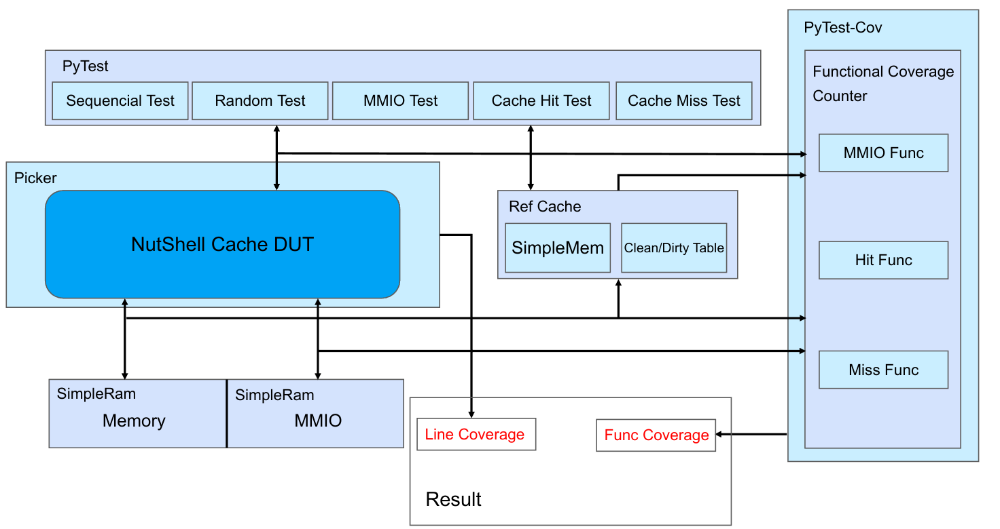

# Nutshell Cache Verification with XS-MLVP
基于XS-MLVP验证环境的Nutshell Cache的验证实践（python）

## Environment

picker(<https://github.com/XS-MLVP/picker>), pytest, python, verilator, gtk wave, lcov

## Framework


## Workdir Structure
```
UT_Cache
├── cache_dut.              // 由picker导出的dut顶层封装
├── func                    // 生成功能覆盖率用
│   ├── cache_func.py
│   ├── __init__.py
│   └── mmio_func.py
├── __init__.py
├── libDPICache.a
├── libUT_Cache.py          // picker导出的封装
├── libUTCache.so
├── pytest.ini              // pytest配置
├── test                    // 测试用例
│   ├── cache_hit_test.py
│   ├── cache_miss_test.py
│   ├── __init__.py
│   ├── mmio_test.py
│   ├── monitor.py          // 功能点检测
│   ├── random_test.py
│   ├── seq_test.py
│   └── tb_cache.py         // 测试用例入口
├── tools
│   └── colorprint.py
├── _UT_Cache.so
├── util                    // 外围设备模拟
│   ├── cachewrapper.py
│   ├── __init__.py
│   ├── message_queue.py
│   ├── ref_cahce.py
│   ├── simplebus.py
│   ├── simplemem.py
│   └── simpleram.py
└── xspcomm                 // xscomm库的python版本(picker生成)
    ├── info.py
    ├── __init__.py
    ├── pyxspcomm.py
    ├── _pyxspcomm.so -> _pyxspcomm.so.0.0.1
    └── _pyxspcomm.so.0.0.1
```

## Command
`make run`: 运行命令`python3 UT_Cache/__init__.py`  
`make pytest`: 执行pytest测试，执行后将在目录`cov/func`中生成功能覆盖率报告  
`make genlcov`: 生成代码覆盖率，执行后将在目录`cov/func`中生成报告  
`make view_wave`: 使用GTK Wave查看波形  

## 更新日志
[2024.4.7]：  
1. 围绕功能点测试调整python测试目录结构。目前思路是在`func_checker.py`中触发功能点检测，然后到func目录下执行相关函数触发覆盖率检测。  
2. 解耦simpleram和总线。方便监控连接simpleram上的总线的信号。  
3. 新增`message_queue.py`，简单的带时间戳的消息队列。主要用于检测与时序相关的feature。  

[2024.4.13]:
1. 更新了(大改了)一下框架
2. 明天再写