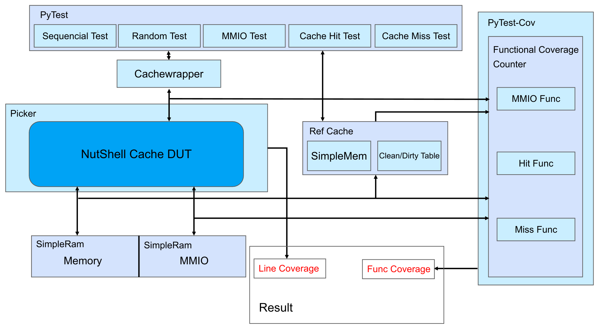

# Nutshell Cache Verification with XS-MLVP
基于XS-MLVP验证环境的Nutshell Cache的验证实践（python）

## Environment

picker(<https://github.com/XS-MLVP/picker>), pytest, python, verilator, gtk wave, lcov

## Framework


## Workdir Structure
```
UT_Cache
├── cache_dut.py                // 使用picker导出的dut顶层封装
├── .coveragerc
├── func                        // 生成功能覆盖率用
│   ├── cache_func.py
│   ├── __init__.py
│   └── mmio_func.py
├── __init__.py
├── libDPICache.a
├── libUT_Cache.py
├── libUTCache.so
├── monitor                     // 功能点（覆盖）检测
│   ├── __init__.py
│   └── monitor.py
├── pytest.ini
├── runner                      // pytest测试入口
│   ├── __init__.py
│   └── tb_cache.py
├── test                        // 测试用例
│   ├── __init__.py
│   ├── test_cache_hit.py
│   ├── test_cache_miss.py
│   ├── test_mmio.py
│   ├── test_random.py
│   └── test_seq.py
├── tools
│   ├── colorprint.py
│   └── my_assert.py
├── _UT_Cache.so
├── util                        // 外围设备模拟
│   ├── cachewrapper.py
│   ├── __init__.py
│   ├── message_queue.py
│   ├── ref_cache.py
│   ├── simplebus.py
│   ├── simplemem.py
│   └── simpleram.py
└── xspcomm                     // xcomm的python版本（picker生成）
    ├── info.py
    ├── __init__.py
    ├── pyxspcomm.py
    ├── _pyxspcomm.so -> _pyxspcomm.so.0.0.1
    └── _pyxspcomm.so.0.0.1
```

## Command
`make run`: 运行命令`python3 UT_Cache/__init__.py`  
`make pytest`: 执行pytest测试，执行后将在目录`cov/func_cov`中生成功能覆盖率报告  
`make genlcov`: 生成代码覆盖率，执行后将在目录`cov/line_cov`中生成报告  
`make view_wave`: 使用GTK Wave查看波形  

## TBD
1. 部分命名的修正  
2. 连续运行`seq_test`/`random_test` + `cache_hit_test`/`cache_miss_test`时出错...（怀疑是ref_cache中的dictioinary溢出？）

## 更新日志
[2024.4.7]：  
1. 围绕功能点测试调整python测试目录结构。目前思路是在`func_checker.py`中触发功能点检测，然后到func目录下执行相关函数触发覆盖率检测。  
2. 解耦simpleram和总线。方便监控连接simpleram上的总线的信号。  
3. 新增`message_queue.py`，简单的带时间戳的消息队列。主要用于检测与时序相关的feature。  

[2024.4.13]:
1. 更新了(大改了)一下框架
2. 修改了一下`Cachewrapper`的结构，在原有的基础上增加两个队列`req_que`和`resp_que`。发送请求时，会将请求暂存在`req_que`中，时钟上升沿到来时会自动检查`req_que`中的情况并发送到总线上。同时，上升沿到来时也会检查是否存在来自cache的回复，若存在则将回复内容放在`resp_que`中。目标是实现将请求的收发解耦。  
3. 在原有的`SimpleMemory`基础上改造参考模型`Ref_Cache`，除了原有的内存功能，还支持cacheline情况查询（是否在cache中，是否为脏块）
4. 修改功能点检测逻辑，在Monitor中(`test/monitor.py`)统一检查。  